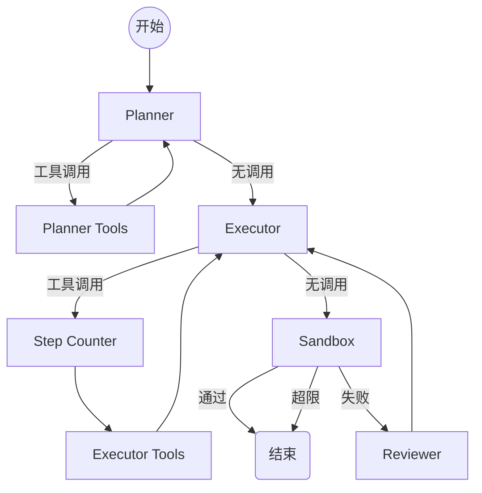

# 技术架构文档

## 系统架构

### 工作流图

### 路由决策

| 路由 | 条件 | 下一节点 |
|------|------|----------|
| `route_after_planner` | 有 tool_calls | `planner_tools` |
| `route_after_planner` | 无 tool_calls | `executor` |
| `route_after_planner` | tool_calls ≥ MAX_PLANNER_STEPS | `executor` (强制结束探索) |
| `route_after_executor` | 有 tool_calls | `executor_step_counter` → `executor_tools` |
| `route_after_executor` | 无 tool_calls 或达到步数上限 | `sandbox` |
| `route_after_sandbox` | 无 error_trace | `END` |
| `route_after_sandbox` | 有 error 且 retry < max | `reviewer` → `executor` |
| `route_after_sandbox` | retry ≥ max | 保存快照 → `END` |

## 核心模块

### 状态管理 (state.py)
- AgentState 作为全局黑板，存储所有 Agent 共享的状态
- 包含消息历史、工程上下文、沙盒控制、分层上下文等信息

### 上下文管理 (context_manager.py)
- 分层记忆策略：核心记忆、工作记忆、参考记忆
- 动态上下文窗口管理，根据 Token 使用情况自动调整
- LLM 智能记忆压缩，减少 Token 消耗

### 工作流编排 (run.py)
- 基于 LangGraph 的状态机设计
- 注册和编排各个 Agent 节点
- 处理路由逻辑和状态转换

### 文件工具 (file_tools.py)
- AST 感知的文件操作
- 支持读取、编辑、写入文件
- 大文件返回 AST 结构大纲

### 代码质量分析 (code_quality.py)
- 支持多种语言的静态代码分析
- 自动检测潜在问题和代码风格问题
- 生成详细的代码质量报告

### 文档自动生成 (documentation.py)
- 自动生成项目 README 和技术文档
- 提取代码注释生成 API 文档
- 支持多种文档格式

## 技术栈

- **后端**: Python 3.10+, LangGraph, FastAPI
- **前端**: React 18, TypeScript, Vite
- **沙盒**: Docker
- **LLM**: 支持 OpenAI、Anthropic、Ollama、DeepSeek
- **代码质量**: flake8, eslint
- **文档**: Markdown